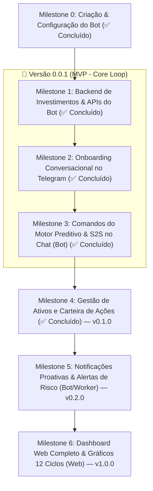

# Roadmap do Produto — Meu Dinheiro

> **Visão do Produto:** Sistema de inteligência financeira pessoal focado em **previsibilidade futura**. O diferencial não é olhar para o passado ou categorizar gastos passivos, mas sim projetar o fluxo futuro através do **Saldo Seguro Diário (S2S)**, simulações de impacto de compras em até 12 ciclos (*what-if*) e acompanhamento de patrimônio e investimentos.
>
> **Estratégia de Lançamento:** O **Bot do Telegram** é a interface primária e prioritária de operação diária (onde o usuário vive e toma decisões de compra). O **Dashboard Web** virá em seguida para relatórios aprofundados e visualizações gráficas de longo prazo.
>
> **Estratégia de Releases:**
> - 🚀 **`v0.0.1` (MVP - Core Loop)**: M1 (APIs Bot) + M2 (Onboarding) + M3 (Operação Diária: `/s2s`, `/gasto`, `/simular`).
> - 📈 **`v0.1.0` (Investimentos)**: M4 (Carteira de Ações & Preço Médio).
> - ⏰ **`v0.2.0` (Proatividade)**: M5 (Workers Agendados & Alertas de Risco).
> - 🌐 **`v1.0.0` (Web & Analytics)**: M6 (Dashboard Web Completo).

---

## 🗺️ Visão Geral dos Milestones



---

## 📍 Detalhamento dos Milestones

### ✅ Milestone 0: Criação & Configuração Oficial do Bot no Telegram
**Foco:** Provisionamento do Bot no ecossistema do Telegram, definição de credenciais, comandos nativos e arquitetura de recepção de mensagens.

- [x] **Provisionamento no @BotFather**:
  - [x] Criar o bot oficial via comando `/newbot` no `@BotFather` (`Julius` / `@meudinheiro_app_bot`).
  - [x] Definir descrição do bot (`/setdescription`) e bio (`/setabouttext`).
  - [x] Obter o token de API (`TELEGRAM_BOT_TOKEN`) e adicioná-lo com segurança ao `.env`.
- [x] **Configuração de Comandos no Telegram (`/setcommands`)**:
  - [x] Registrar a lista de comandos no menu nativo do Telegram para auto-completar:
    ```text
    s2s - Consultar seu Saldo Seguro Diário e saúde do ciclo
    gasto - Registrar uma despesa rápida (ex: /gasto 45 Almoço)
    simular - Projetar compra parcelada em até 12 ciclos futuros
    investimento - Adicionar ativo à carteira (ex: /investimento ALUP11, 10 un a 42.23)
    investimentos - Visualizar patrimônio e carteira de ações
    checkin - Fazer o check-in diário e conciliação de saldo
    ajuda - Instruções e lista de comandos
    ```
- [x] **Arquitetura de Comunicação (Long Polling vs. Webhook)**:
  - [x] Suporte nativo a **Long Polling** para desenvolvimento local sem necessidade de túnel ou IP público.
  - [x] Suporte a **Webhook** HTTPS com validação estrita de secret token (`X-Telegram-Bot-Api-Secret-Token`) e endpoint de healthcheck (`/health`) para deploy em produção no Coolify.

---

### ✅ Milestone 1: Backend de Investimentos, Gastos Essenciais & APIs para o Bot `[v0.0.1]`
**Foco:** Preparar o modelo de dados e endpoints internos na `apps/api` para suportar patrimônio em ações, ciclo personalizado, recomendação inteligente de reserva e a operação direta do Bot via `telegram_id`.

- [x] **Esquema de Banco de Dados (`tb_investments` e perfil em `tb_users`)**:
  - Nova tabela no PostgreSQL 18:
    - `id UUID PRIMARY KEY DEFAULT uuidv7()`
    - `user_id UUID NOT NULL REFERENCES tb_users(id) ON DELETE CASCADE`
    - `ticker VARCHAR(12) NOT NULL` (ex: `ALUP11`, `BBAS3`, `IVVB11` normalizado em uppercase)
    - `quantity NUMERIC(15, 4) NOT NULL CHECK (quantity > 0)`
    - `average_price NUMERIC(15, 2) NOT NULL CHECK (average_price >= 0)`
    - `created_at` e `updated_at` TIMESTAMPTZ
    - `UNIQUE(user_id, ticker)` com suporte a compras incrementais recalculando o preço médio ponderado.
  - Extensão da `tb_users` com colunas de perfil e metas:
    - `target_savings NUMERIC(19, 2) NOT NULL DEFAULT 0.00`
    - `flexible_budget_cap NUMERIC(19, 2) NOT NULL DEFAULT 0.00`
    - `emergency_fund_target NUMERIC(19, 2) NOT NULL DEFAULT 0.00`
    - `emergency_fund_months INTEGER NOT NULL DEFAULT 6`
    - `cycle_start_day INTEGER NOT NULL DEFAULT 1 CHECK (cycle_start_day BETWEEN 1 AND 28)`
- [x] **Ciclo Financeiro Dinâmico (`dateinterval.CycleOf`)**:
  - Cálculo determinístico de ciclos mensais personalizados iniciando no dia definido pelo usuário (`cycle_start_day`, default 1).
- [x] **Módulo `internal/investment` (Go)**:
  - CRUD de investimentos com arredondamento `decimal.RoundBank` (HalfEven).
  - Cálculo de Preço Médio Ponderado na adição de novos lotes:
    $$\text{Novo PM} = \frac{(\text{Qtd Atual} \times \text{PM Atual}) + (\text{Qtd Nova} \times \text{Preço Novo})}{\text{Qtd Total}}$$
  - Abatimento de posição (vendas) mantendo o PM e deleção automática ao zerar.
  - Endpoints REST autenticados para web (`/investments`).
- [x] **Gastos Essenciais & Recomendação Inteligente de Reserva de Emergência**:
  - Cálculo automático de custo fixo mensal somando despesas essenciais.
  - Projeção de reserva sugerida em 6 meses (CLT) e 12 meses (PJ/autônomo).
  - Métricas em tempo real no contexto: meses cobertos e progresso da meta.
- [x] **Endpoints de Comunicação Bot ↔ API (Pacote `internal/botapi`)**:
  - `POST /internal/users/onboarding`: Salva saldo inicial, ciclo, gastos essenciais, reserva 6x/12x, aporte mensal e investimentos.
  - `GET /internal/users/context-by-telegram?telegram_id=...`: Retorna o contexto financeiro completo (contas, ciclo, S2S atual, reserva e investimentos) protegido por `X-Internal-Secret` ou `X-Internal-API-Key`.
  - `POST /internal/investments`: Registro ou incremento de ativos vinculados ao `telegram_id`.
  - `POST /internal/transactions/quick-expense`: Lançamento direto de despesa via bot com cálculo imediato do impacto no S2S.
- [x] **Cliente Go no Bot (`apps/bot/internal/client`)**:
  - Implementação de `SaveOnboarding`, `GetUserContextByTelegram`, `AddInvestment` e `QuickExpense` com testes unitários.

---

### ✅ Milestone 2: Onboarding Conversacional no Telegram `[v0.0.1]`
**Foco:** Prover a primeira experiência de uso encantadora e guiada logo após o `/start` ou autorização de login.

- [x] **Máquina de Estados de Conversação (State Machine)**:
  - Gerenciador de estado de diálogo em memória (`SessionStore` thread-safe com `sync.RWMutex` e expurgo por TTL via ticker) para cada `telegram_id`:
    - `StateIdle`
    - `StateWaitingBalance`
    - `StateWaitingCycleDay`
    - `StateWaitingFixedExpenses`
    - `StateWaitingEmergencyFundChoice`
    - `StateWaitingSavingsTarget`
    - `StateWaitingInvestmentChoice`
    - `StateWaitingInvestmentInput`
  - Tipagem forte de callbacks via `Action` e validação estrita de estado contra replay/cliques fora de ordem.
- [x] **Fluxo Guiado de Boas-Vindas**:
  1. **Boas-vindas:** Explicação rápida do método de Saldo Seguro Diário e previsibilidade.
  2. **Pergunta 1 (Liquidez):** *"Para começar, qual o seu saldo total somando suas contas correntes hoje? (Ex: 3500.00)"*
  3. **Pergunta 2 (Início do Ciclo):** *"Em qual dia costuma cair seu salário para reiniciarmos seu ciclo mensal? (Padrão: dia 01, teto defensivo: dia 28)"*
  4. **Pergunta 3 (Gastos Essenciais):** *"Quanto você estima gastar por mês com despesas essenciais como moradia/aluguel, mercado e saúde? (Ex: 1500 aluguel, 800 mercado)"*
     - Botão inline de 1 clique: `[ ✅ Concluir Despesas Fixas ]` para fechar a soma instantaneamente.
  5. **Pergunta 4 (Reserva de Emergência):**
     - O bot calcula na hora:
       > *"Seu custo essencial mensal é de R$ 2.300. Para sua segurança, recomendamos montar uma Reserva de Emergência. Você prefere uma meta de **6 meses (CLT)** ou **12 meses (PJ/Autônomo)**?"*
     - Botões inline de 1 clique com valor calculado em reais: `[ 🎯 6 Meses (CLT) - R$ 13.800,00 ]` ou `[ 🎯 12 Meses (PJ) - R$ 27.600,00 ]`.
     - Em seguida pergunta o aporte mensal: *"Quanto deseja guardar por mês para essa reserva? (Ex: 300.00)"*
  6. **Pergunta 5 (Investimentos):** *"Você possui dinheiro investido em ações ou outros ativos que gostaria de cadastrar agora?"*
     - Botões inline: `[ ➕ Adicionar Ativo ]` e `[ ⏭️ Pular Etapa ]`.
     - Parser flexível de ticker, quantidade e preço (ex: `ALUP11 10 42.23` ou `PETR4 100 cotas a 38.50`).
  7. **Cálculo Inicial & Painel Diário:** O bot persiste o setup na API via `SaveOnboarding`, expurga a sessão da FSM e entrega o primeiro relatório:
     > *"🎉 Configuração Concluída com Sucesso! Seu Saldo Seguro Diário (S2S) para os próximos 30 dias é **R$ 78,50/dia**. Status: **SAUDÁVEL**."*
  8. **Reconhecimento de Usuário Cadastrado:** Se o usuário já possuir cadastro prévio e enviar `/start`, a FSM exibe diretamente o Painel Diário com S2S de Hoje, Status de Saúde, Dias Restantes e Resumo Patrimonial.

---

### ✅ Milestone 3: Comandos do Motor Preditivo & Operação Diária `[v0.0.1]`
**Foco:** Integrar todos os superpoderes do motor matemático diretamente no chat do Telegram.

- [x] **Comando `/s2s`**:
  - Consulta o Saldo Seguro Diário em tempo real.
  - Exibe dias restantes do ciclo, limite flexível diário e badge de saúde financeira (`🟢 SAUDÁVEL`, `🟡 RESTRITO`, `🔴 RISCO DE DÉFICIT`).
  - Ativa o Teclado Persistente 2x2 (`/s2s`, `/gasto`, `/simular`, `/checkin`).
- [x] **Comando `/gasto <valor> [descrição]`**:
  - Exemplo: `/gasto 34.90 Almoço` ou `/gasto 120`.
  - Exibe botões inline dinâmicos com as categorias do usuário (Moradia, Alimentação, etc.).
  - Cria transação do tipo `FLEXIBLE_EXPENSE` e retorna o recibo com o impacto imediato no S2S:
    > *"💸 Gasto de R$ 34,90 registrado em Alimentação. Seu novo S2S para hoje é **R$ 78,12**."*
- [x] **Comando `/renda <valor> [descrição]` (e alias `/receita`)**:
  - Exemplo: `/renda 5000 Salário` ou `/receita 350 Freelance`.
  - Registra transação `INCOME` confirmada com recalibração imediata do saldo líquido e do S2S para cima.
- [x] **Comando `/simular <valor> [parcelas]`**:
  - Exemplo: `/simular 2400 12` (Compra de R$ 2.400 em 12x) ou `/simular 350` (à vista).
  - Executa o simulador *what-if* de 1 a 12 ciclos futuros na API.
  - Responde ao usuário com diagnóstico preditivo de impacto, ciclo mais crítico e recomendação.
  - Inclui botão inline de 1 clique: `[ ✅ Lançar Compra Agora ]` para efetivar imediatamente o parcelamento no banco.
- [x] **Comando `/checkin`**:
  - Wizard interativo via FSM para conciliar gastos não rastreados do dia e saldo bancário real.
  - Persistência atômica e idempotente do snapshot diário em `tb_check_in_snapshots`.

---

### ✅ Milestone 4: Gestão de Ativos & Carteira de Ações `[v0.1.0]`
**Foco:** Permitir que o usuário acompanhe e expanda sua carteira de investimentos pelo Telegram com recálculo de Preço Médio, apuração de Lucro/Prejuízo em vendas e visão consolidada de patrimônio.

- [x] **Comando `/investimento` (e aliases `/comprar`, `/aporte`)**:
  - Expressão regular flexível e expandida (`^[A-Z0-9.\-_]{1,12}$`) aceitando ações, ETFs e Renda Fixa:
    - `/investimento ALUP11, 10 unidades a 42.23`
    - `/comprar PETR4 100 cotas a 38.50`
    - `/aporte TD-SELIC 1 a 14500`
    - `/aporte CDB-INTER 5000`
  - Se o ativo já existir na carteira, calcula o novo Preço Médio ponderado com arredondamento HalfEven (`decimal.RoundBank`) e acumula a posição.
  - Card educativo copiável de instrução exibido imediatamente ao invocar o comando sem parâmetros.
- [x] **Comando `/carteira` (e aliases `/investimentos`, `/portfolio`)**:
  - Cards formatados em blocos de 2 linhas por papel com emojis temáticos.
  - Ordenação automática por volume financeiro total investido (R$) decrescente.
  - Cálculo e exibição do percentual de alocação de cada ativo sobre o total investido.
  - Rodapé consolidado com Total Investido, Saldo Líquido em Contas e Patrimônio Líquido Total.
  - Card acolhedor para carteira vazia com exemplos práticos copiáveis e botão inline `[➕ Adicionar Ativo]`.
  - Botões inline `[➕ Novo Aporte]` e `[🔄 Atualizar]` com edição *in-place* (`tgbotapi.NewEditMessageTextAndMarkup`) no refresh sem poluição do chat.
- [x] **Comando `/venda` (e alias `/vender`)**:
  - Abatimento transacional de posição na custódia com lock `SELECT ... FOR UPDATE` via `POST /internal/investments/sell`.
  - Suporte a comandos com preço (`/venda PETR4 30 a 41.50`) e sem preço (`/venda PETR4 30`).
  - Apuração em tempo real de Lucro/Prejuízo realizado em R$ e % com badges visuais (`🟢 Lucro` / `🔴 Prejuízo`).
  - Botão inline opcional `[💳 Creditar R$ X no Saldo Líquido]` via `POST /internal/transactions/income` e `[🛡️ Manter Apenas na Carteira]`.
  - Atalho inteligente de excesso de custódia `[Vender Todas as X]` ao tentar vender acima do saldo em carteira.
  - Encerramento automático de posição zerada com card especial `🏁 Posição Encerrada!` e ciclo de recompra limpo (novo PM).
  - Botão efêmero de reversão rápida `[↩️ Desfazer Venda]` recompondo as cotas ao Preço Médio original.
- [x] **Preservação da UX & Teclado Persistente**:
  - O teclado inferior 2x2 permanece estritamente focado no fluxo de caixa diário (`/s2s`, `/gasto`, `/simular`, `/checkin`), isolando ações de investimento em botões inline contextuais.
- [x] **Troféu de Testes**:
  - 7 testes de integração ponta a ponta na API contra PostgreSQL 18 via Testcontainers em `internal_bot_api_investment_test.go`.
  - 8 suítes completas de testes unitários com `-race` no Bot em `bot_invest_test.go` e `parsers_test.go`.

---

### 🟢 Milestone 5: Notificações Proativas & Alertas de Risco `[v0.2.0]`
**Foco:** O bot deixa de ser apenas reativo e passa a ser um assistente pessoal ativo.

- [ ] **Worker de Bom Dia (S2S Matinal)**:
  - Envio agendado (ex.: 08:00): *"Bom dia! Seu S2S disponível para hoje é R$ 92,00. 18 dias restantes no ciclo."*
- [ ] **Alerta de Degradação de Ciclo**:
  - Se um gasto registrado mudar o status de `HEALTHY` para `RESTRICTED` ou `DEFICIT_RISK`, dispara alerta preventivo imediato.
- [ ] **Lembrete de Check-in Noturno**:
  - Notificação amigável às 21:00 convidando para fechar o dia com `/checkin`.

---

### 🟢 Milestone 6: Dashboard Web Completo & Projeção Gráfica `[v1.0.0]`
**Foco:** Interface visual rica em Vue 3 para planejamento estratégico e relatórios.

- [ ] **Gráfico de Projeção dos 12 Ciclos**:
  - Linha do tempo visual exibindo o fluxo de caixa projetado mês a mês.
  - Curva de saldo livre vs. parcelamentos vigentes vs. reserva acumulada.
- [ ] **Painel de Investimentos**:
  - Gráfico de pizza por ativo/classe e tabela de alocação de patrimônio.
- [ ] **Extrato Analítico & Gestão de Contas**:
  - Filtros avançados, edição e cancelamento de bundles/parcelamentos.

---

## 📋 Resumo das Fases de Entrega

| Versão Alvo | Milestone | Escopo Principal | Entrega | Status |
|---|---|---|---|---|
| **`v0.0.1`** | **M0** | Criação, Token, Comandos e Webhook do Bot | Telegram / `apps/bot` | ✅ Concluído |
| **`v0.0.1`** *(MVP Core Loop)* | **M1** | Backend de Investimentos & APIs Bot | `apps/api` | ✅ Concluído |
| **`v0.0.1`** *(MVP Core Loop)* | **M2** | Onboarding Conversacional & Saldo Inicial | `apps/bot` | ✅ Concluído |
| **`v0.0.1`** *(MVP Core Loop)* | **M3** | Comandos S2S, /gasto, /simular, /checkin e /renda | `apps/bot` | ✅ Concluído |
| **`v0.1.0`** | **M4** | Carteira de Ações, Aportes, Vendas e P&L | `apps/api` + `apps/bot` | ✅ Concluído |
| **`v0.2.0`** | **M5** | Notificações Proativas & Worker S2S | `apps/bot` + Worker | ⏳ Planejado |
| **`v1.0.0`** | **M6** | Dashboard Web Completo & Gráficos 12 Meses | `apps/web` | ⏳ Futuro |
