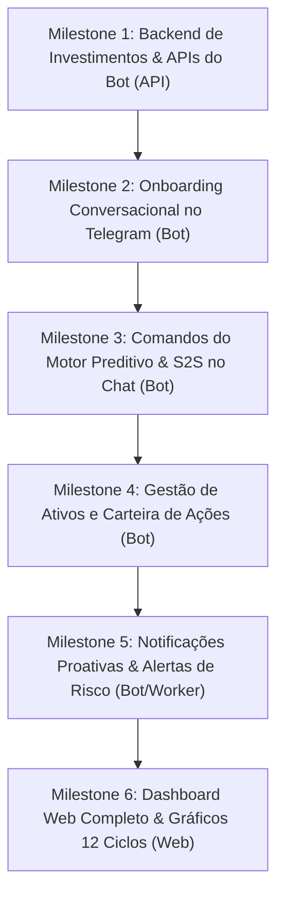

# Roadmap do Produto — Meu Dinheiro

> **Visão do Produto:** Sistema de inteligência financeira pessoal focado em **previsibilidade futura**. O diferencial não é olhar para o passado ou categorizar gastos passivos, mas sim projetar o fluxo futuro através do **Saldo Seguro Diário (S2S)**, simulações de impacto de compras em até 12 ciclos (*what-if*) e acompanhamento de patrimônio e investimentos.
>
> **Estratégia de Lançamento:** O **Bot do Telegram** é a interface primária e prioritária de operação diária (onde o usuário vive e toma decisões de compra). O **Dashboard Web** virá em seguida para relatórios aprofundados e visualizações gráficas de longo prazo.

---

## 🗺️ Visão Geral dos Milestones



---

## 📍 Detalhamento dos Milestones

### 🟢 Milestone 1: Backend de Investimentos & APIs para o Bot
**Foco:** Preparar o modelo de dados e endpoints internos na `apps/api` para suportar patrimônio em ações e a operação direta do Bot via `telegram_id`.

- [ ] **Esquema de Banco de Dados (`tb_investments`)**:
  - Nova tabela no PostgreSQL 18:
    - `id UUID PRIMARY KEY DEFAULT uuidv7()`
    - `user_id UUID NOT NULL REFERENCES tb_users(id) ON DELETE CASCADE`
    - `ticker VARCHAR(12) NOT NULL` (ex: `ALUP11`, `BBAS3`, `IVVB11` normalizado em uppercase)
    - `quantity NUMERIC(15, 4) NOT NULL CHECK (quantity > 0)`
    - `average_price NUMERIC(15, 2) NOT NULL CHECK (average_price >= 0)`
    - `created_at` e `updated_at` TIMESTAMPTZ
    - `UNIQUE(user_id, ticker)` com suporte a compras incrementais recalculando o preço médio ponderado.
- [ ] **Módulo `internal/investment` (Go)**:
  - CRUD de investimentos com arredondamento `decimal.RoundBank`.
  - Cálculo de Preço Médio Ponderado na adição de novos lotes:
    $$\text{Novo PM} = \frac{(\text{Qtd Atual} \times \text{PM Atual}) + (\text{Qtd Nova} \times \text{Preço Novo})}{\text{Qtd Total}}$$
- [ ] **Endpoints de Comunicação Bot ↔ API**:
  - `POST /internal/users/onboarding`: Salva saldo inicial em conta, meta de poupança e inicialização de patrimônio.
  - `GET /internal/users/context-by-telegram?telegram_id=...`: Retorna o contexto financeiro completo do usuário (contas, S2S atual, saúde do ciclo e investimentos) protegido por `X-Internal-Secret`.
  - `POST /internal/investments`: Registro ou incremento de ativos vinculados ao `telegram_id`.
  - `POST /internal/transactions/quick-expense`: Lançamento direto de despesa via bot.

---

### 🟢 Milestone 2: Onboarding Conversacional no Telegram
**Foco:** Prover a primeira experiência de uso encantadora e guiada logo após o `/start` ou autorização de login.

- [ ] **Máquina de Estados de Conversação (State Machine)**:
  - Gerenciador de estado de diálogo em memória ou banco para cada `telegram_id`:
    - `STATE_IDLE`
    - `STATE_ONBOARDING_BALANCE`
    - `STATE_ONBOARDING_SAVINGS_TARGET`
    - `STATE_ONBOARDING_HAS_INVESTMENTS`
    - `STATE_ONBOARDING_INVESTMENT_TICKER`
    - `STATE_ONBOARDING_INVESTMENT_QTY`
    - `STATE_ONBOARDING_INVESTMENT_PRICE`
- [ ] **Fluxo Guiado de Boas-Vindas**:
  1. **Boas-vindas:** Explicação rápida do método de Saldo Seguro Diário e previsibilidade.
  2. **Pergunta 1 (Liquidez):** *"Para começar, qual o seu saldo total somando suas contas correntes hoje? (Ex: 3500.00)"*
  3. **Pergunta 2 (Meta de Reserva):** *"Qual valor você deseja blindar como meta de poupança/reserva este mês? (Ex: 1000.00)"*
  4. **Pergunta 3 (Investimentos):** *"Você possui dinheiro investido em ações ou outros ativos? (Sim / Não)"*
  5. **Se "Sim":**
     - Pergunta a tag da ação (*ticker*), quantidade e preço médio:
       > *"Envie o ticker da ação e a quantidade. Exemplo: `ALUP11 10 unidades a 42.23` ou digite apenas a tag para fazermos passo a passo."*
     - O bot cadastra o ativo e pergunta: *"Deseja cadastrar mais alguma ação ou finalizar?"*
  6. **Cálculo Inicial:** O bot roda o motor preditivo e entrega o primeiro relatório:
     > *"✅ Configuração concluída! Seu Saldo Seguro Diário (S2S) para os próximos 30 dias é **R$ 83,33/dia**. Status: **SAUDÁVEL**."*

---

### 🟢 Milestone 3: Comandos do Motor Preditivo & Operação Diária
**Foco:** Integrar todos os superpoderes do motor matemático diretamente no chat do Telegram.

- [ ] **Comando `/s2s`**:
  - Consulta o Saldo Seguro Diário em tempo real.
  - Exibe dias restantes do ciclo, limite flexível diário e badge de saúde financeira (`🟢 SAUDÁVEL`, `🟡 RESTRITO`, `🔴 RISCO DE DÉFICIT`).
- [ ] **Comando `/gasto <valor> <descrição>`**:
  - Exemplo: `/gasto 34.90 Almoço` ou `/gasto 120 Mercado`.
  - Cria transação do tipo `EXPENSE` e retorna o impacto imediato no S2S:
    > *"Gasto de R$ 34,90 registrado em Alimentação. Seu novo S2S para hoje é **R$ 78,12**."*
- [ ] **Comando `/simular <valor> [parcelas]` (Método do Breno)**:
  - Exemplo: `/simular 2400 12` (Compra de R$ 2.400 em 12x).
  - Executa o simulador *what-if* de 1 a 12 ciclos futuros na API.
  - Responde ao usuário com diagnóstico preditivo:
    > *"🔮 **Simulação de Compra: R$ 2.400 em 12x de R$ 200,00**\n\n"*
    > *"⚠️ **Atenção:** Essa compra reduzirá seu S2S de R$ 85/dia para R$ 51/dia e gerará risco de déficit no **Ciclo 5 (Maio)**.\n"*
    > *"Recomendação: Aguarde a liquidação de parcelas anteriores antes de assumir esse novo parcelamento."*
- [ ] **Comando `/checkin`**:
  - Wizard interativo para conciliar o saldo do dia e registrar o snapshot diário em `tb_check_in_snapshots`.

---

### 🟢 Milestone 4: Gestão de Ativos & Carteira de Ações
**Foco:** Permitir que o usuário acompanhe e expanda sua carteira de investimentos pelo Telegram.

- [ ] **Comando `/investimento <TICKER>, <QUANTIDADE> unidades a <PRECO>`**:
  - Expressão regular flexível para aceitar variações comuns:
    - `/investimento ALUP11, 10 unidades a 42.23`
    - `/investimento ALUP11 10 42.23`
    - `/investimento PETR4 100 cotas a 38.50`
  - Se o ativo já existir na carteira, calcula o novo Preço Médio ponderado e soma a posição.
- [ ] **Comando `/investimentos` ou `/carteira`**:
  - Lista todos os ativos cadastrados, posições e patrimônio investido:
    ```text
    📊 Sua Carteira de Investimentos

    • ALUP11: 10 un. | PM: R$ 42,23 | Total: R$ 422,30
    • BBAS3:  50 un. | PM: R$ 27,50 | Total: R$ 1.375,00
    • IVVB11:  5 un. | PM: R$ 310,00| Total: R$ 1.550,00
    --------------------------------------------------
    Total Investido: R$ 3.347,30
    Patrimônio Total (Contas + Ações): R$ 8.120,50
    ```
- [ ] **Comando `/venda <TICKER> <QUANTIDADE> a <PRECO>`**:
  - Abatimento de posição na carteira e lançamento opcional do crédito na conta bancária.

---

### 🟢 Milestone 5: Notificações Proativas & Alertas de Risco
**Foco:** O bot deixa de ser apenas reativo e passa a ser um assistente pessoal ativo.

- [ ] **Worker de Bom Dia (S2S Matinal)**:
  - Envio agendado (ex.: 08:00): *"Bom dia! Seu S2S disponível para hoje é R$ 92,00. 18 dias restantes no ciclo."*
- [ ] **Alerta de Degradação de Ciclo**:
  - Se um gasto registrado mudar o status de `HEALTHY` para `RESTRICTED` ou `DEFICIT_RISK`, dispara alerta preventivo imediato.
- [ ] **Lembrete de Check-in Noturno**:
  - Notificação amigável às 21:00 convidando para fechar o dia com `/checkin`.

---

### 🟢 Milestone 6: Dashboard Web Completo & Projeção Gráfica
**Foco:** Interface visual rica em Vue 3 para planejamento estratégico e relatórios.

- [ ] **Gráfico de Projeção dos 12 Ciclos**:
  - Linha do tempo visual exibindo o fluxo de caixa projetado mês a mês.
  - Curva de saldo livre vs. parcelamentos vigentes vs. reserva acumulada.
- [ ] **Painel de Investimentos**:
  - Gráfico de pizza por ativo/classe e tabela de alocação de patrimônio.
- [ ] **Extrato Analítico & Gestão de Contas**:
  - Filtros avançados, edição e cancelamento de bundles/parcelamentos.

---

## 📋 Resumo das Fases de Entrega

| Milestone | Escopo Principal | Entrega | Status |
|---|---|---|---|
| **M1** | Backend de Investimentos & APIs Bot | `apps/api` | 🔄 A Iniciar |
| **M2** | Onboarding Conversacional & Saldo Inicial | `apps/bot` | ⏳ Planejado |
| **M3** | Comandos S2S, /gasto e Simulador What-If | `apps/bot` | ⏳ Planejado |
| **M4** | Comando `/investimento` & Carteira de Ações | `apps/bot` | ⏳ Planejado |
| **M5** | Notificações Proativas & Worker S2S | `apps/bot` + Worker | ⏳ Planejado |
| **M6** | Dashboard Web Completo & Gráficos 12 Meses | `apps/web` | ⏳ Futuro |
